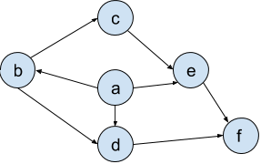

## Hashes

As we learned breifly at the end of class today, a [_hash function_](https://en.wikipedia.org/wiki/Hash_function) is a map from a set of information of varying sizes (for example, a string of arbitrary length) to a set of information of same length (for example, 32-bit integers).  To be clear, this definition requires that the function be _deterministic_, meaning that if I put something in multiple times, I'll get the same answer out every time.  Note that this doesn't disallow, and in fact cannot disallow, _collisions_: finding two inputs which hash to the same value.  However, one desirable effect is that a hash function have [_good avalanching_](https://en.wikipedia.org/wiki/Avalanche_effect), meaning that the changes in input and changes in output are uncorrelated: if I change `hello` to `helln`, then their hashes should probably be very different.

Come up with a hash from binary numbers of any length to 32-bit integers that ensures that no two (distinct) numbers with the same length (_i.e._ number of bits) form a collision.  Give an informal justification as to why you think you're right.

## DAGs

Let us say that the _graphical form_ of a DAG is the visual picture of the graph.  Let us say that the _file form_ of a DAG is as follows. Given a graph whose graphical form is:

It's file form is:
`{a:[b, d, e], b:[c, d], c: [e], d: [f], e: [f], f: []}`

What is a sure-fire way to write down something that _looks like_ the file form of a DAG and ensure that it in fact _is_ the file form of some DAG?  Test out your hypothesis by creating two examples, and one non-example (example of the hypotheses not being held results in a non-DAG).
