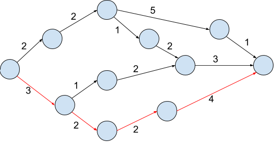

# Directed Acyclic Graphs

Consider a directed acyclic graph with exactly one source and one sink.  The nodes of the graph represent the _milestones_ of a software library being constructed. The edges of the graph represent that tasks that must be completed to move to a new milestone. Each task takes some number of weeks to complete, indicated by the _weight_ of the edge, written on the diagram next to the edge.  See the figure below.

Our task is to find an algorithm to determine, given enough workers to always work on all concurrent pieces, how long the project will take, and what the _critical paths_ are, _i.e._ those paths from the beginning of the project to the end which are longest.  There may be many of them!  Do not implement your algorithm (we would first need to build a DAG object in some language, for example), but do test it out on many example graphs.
